# Documentação Técnica — Exclusão Mútua Distribuída (Algoritmo Centralizado)

> Documentação didática e exaustiva do projeto de **exclusão mútua distribuída**
> implementado em Python 3 com comunicação por **sockets TCP**.
> Escrita para que um desenvolvedor júnior entenda **cada decisão, cada método e
> cada trecho de código** sem ajuda externa.

## Plano de fases da documentação

| Fase | Conteúdo | Status |
|------|----------|--------|
| **1** | Visão geral e arquitetura (conceitos, arquivos, diagramas, threads) | ✅ Concluída |
| **2** | `utils.py` — protocolo de mensagens em detalhe | ✅ Concluída |
| **3** | `coordenador.py` — cada thread e função, linha a linha | ✅ Concluída |
| **4** | `processo.py` — o cliente | ✅ Concluída |
| **5** | `executar.py` + `validar.py` — orquestração e validação | ✅ Esta entrega |
| **6** | Execução, cenários de teste e problemas conhecidos | ✅ Esta entrega |

---

# Fase 1 — Visão Geral e Arquitetura

## 1.1 O que é este projeto?

Este projeto implementa o **algoritmo centralizado de exclusão mútua distribuída**.

Imagine vários programas (processos) rodando ao mesmo tempo que precisam escrever
no **mesmo arquivo** (`resultado.txt`). Se dois deles escreverem exatamente no
mesmo instante, o conteúdo pode se misturar e corromper. Precisamos garantir que
**apenas um processo por vez** tenha acesso a esse recurso compartilhado. Esse
"acesso exclusivo" é o que chamamos de **exclusão mútua**, e o pedaço de código
que só pode ser executado por um processo de cada vez é a **região crítica (RC)**.

A estratégia **centralizada** resolve isso com um árbitro único: o **coordenador**.
Nenhum processo entra na região crítica por conta própria — todos precisam **pedir
permissão** ao coordenador, que concede o acesso a um de cada vez, em ordem.

### A analogia do banheiro com uma única chave

Pense em um escritório com um único banheiro e **uma única chave** guardada na
recepção (o coordenador):

- Quem quer usar o banheiro vai até a recepção e **pede a chave** (`REQUEST`).
- Se a chave está livre, a recepção **entrega a chave** (`GRANT`).
- Se a chave já está com alguém, o solicitante **entra numa fila de espera**.
- Ao sair, a pessoa **devolve a chave** (`RELEASE`), e a recepção entrega para o
  **próximo da fila**.

Esse é exatamente o algoritmo que implementamos. A recepção é o `coordenador.py`,
as pessoas são os `processo.py`, e a chave é o direito de escrever em
`resultado.txt`.

## 1.2 Conceitos fundamentais

| Termo | Significado no projeto |
|-------|------------------------|
| **Região crítica (RC)** | O trecho onde o processo abre `resultado.txt`, escreve seu PID + horário e fecha o arquivo. Só um processo por vez pode estar nela. |
| **Exclusão mútua** | A garantia de que nunca há dois processos na RC ao mesmo tempo. |
| **Coordenador** | Processo árbitro que recebe pedidos e concede o acesso, um de cada vez. |
| **PID** | Identificador numérico de cada processo (1, 2, 3, ...). |
| **REQUEST / GRANT / RELEASE** | Os três tipos de mensagem trocados (pedir / conceder / liberar). |
| **Fila de pedidos** | Estrutura que guarda quem está esperando, em ordem de chegada (FIFO). |
| **Starvation (inanição)** | Situação ruim em que um processo nunca é atendido. A fila FIFO evita isso. |

## 1.3 Estrutura de arquivos

O projeto é dividido em arquivos pequenos e com responsabilidade única:

| Arquivo | Responsabilidade | Fase |
|---------|------------------|------|
| `utils.py` | Define o **protocolo de mensagens**: como uma mensagem vira bytes e vice-versa. | 2 |
| `coordenador.py` | O **árbitro** multi-threaded: aceita conexões, roda o algoritmo, oferece interface de terminal. | 3 |
| `processo.py` | O **cliente**: conecta, pede acesso, executa a RC e libera, repetindo `r` vezes. | 4 |
| `executar.py` | **Lançador**: sobe `n` processos de uma vez e dispara a validação no final. | 5 |
| `validar.py` | **Validador automático**: confere se o resultado e o log estão corretos. | 5 |
| `resultado.txt` | Saída da região crítica: uma linha por execução (`PID i | hora`). | — |
| `logs/coordenador.log` | Log de todas as mensagens recebidas/enviadas, com horário em milissegundos. | — |

## 1.4 Arquitetura geral

O sistema tem dois tipos de programa: **um** coordenador e **n** processos. Cada
processo tem o seu próprio socket TCP ligado ao coordenador. O coordenador é
**multi-threaded** (3 threads) e mantém o estado compartilhado protegido por um
cadeado (`estado_lock`).

```mermaid
graph TB
    subgraph Processos["Processos clientes (n instâncias)"]
        P1["Processo 1<br/>(1 socket)"]
        P2["Processo 2<br/>(1 socket)"]
        Pn["Processo n<br/>(1 socket)"]
    end

    subgraph Coord["Coordenador (processo único, 3 threads)"]
        TA["🧵 Thread Aceitar<br/>servidor.accept()"]
        TAL["🧵 Thread Algoritmo<br/>selectors.select()"]
        TI["🧵 Thread Interface<br/>input() no terminal"]
        Q["fila_pedidos (deque)<br/>cabeça = titular da RC"]
        CL["clientes<br/>PID → socket"]
        LOCK{{"estado_lock<br/>(protege Q e clientes)"}}
    end

    ARQ[("resultado.txt")]
    LOG[("logs/coordenador.log")]

    P1 & P2 & Pn -. 1. conexão TCP .-> TA
    P1 & P2 & Pn == 2. REQUEST / RELEASE ==> TAL
    TAL == 3. GRANT ==> P1 & P2 & Pn
    P1 & P2 & Pn -- 4. escrita na RC --> ARQ

    TA --> Q
    TAL --> Q
    TI --> Q
    Q -.protegida por.- LOCK
    TA --> CL
    TAL --> LOG
```

**Leitura do diagrama:**

1. Cada processo abre uma **conexão TCP** com o coordenador (atendida pela *Thread Aceitar*).
2. Os processos enviam **REQUEST** (quero entrar) e **RELEASE** (estou saindo), lidos pela *Thread Algoritmo*.
3. A *Thread Algoritmo* responde com **GRANT** (pode entrar) para um processo por vez.
4. Ao receber o GRANT, o processo entra na RC e **escreve em `resultado.txt`**.

A *Thread Interface* permite ao operador inspecionar a fila e encerrar o sistema
pelo terminal. As três threads compartilham `fila_pedidos` e `clientes`, por isso
todo acesso a essas estruturas passa pelo `estado_lock`.

## 1.5 O protocolo de mensagens (visão alto nível)

Toda comunicação usa **strings de tamanho fixo F = 16 bytes**. Isso simplifica a
leitura: o coordenador sempre lê exatamente 16 bytes e sabe que tem uma mensagem
completa. O formato é:

```
<id_da_mensagem> | <pid> | <preenchimento com zeros até 16 bytes>
```

| Mensagem | id | Exemplo (PID 3) | Quem envia |
|----------|----|-----------------|-----------|
| REQUEST | `1` | `1|3|000000000000` | Processo |
| GRANT | `2` | `2|3|000000000000` | Coordenador |
| RELEASE | `3` | `3|3|000000000000` | Processo |

> Os detalhes de como essa string é montada e lida (`serializar`, `parsear`,
> `receber_completo`) são o tema da **Fase 2**.

## 1.6 Fluxo completo de uma requisição

O diagrama abaixo mostra o ciclo de **um** processo pedindo, usando e liberando a
região crítica — o caso sem disputa (a fila estava vazia):

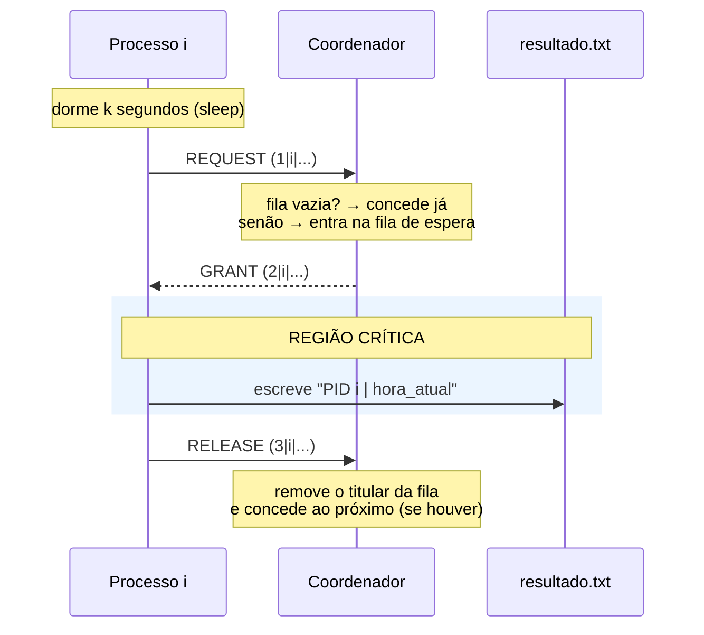

E quando **há disputa** (vários processos pedindo)? O coordenador serializa: o
primeiro recebe GRANT, os demais ficam na fila e recebem o GRANT um a um, na
ordem de chegada, à medida que o anterior envia RELEASE.

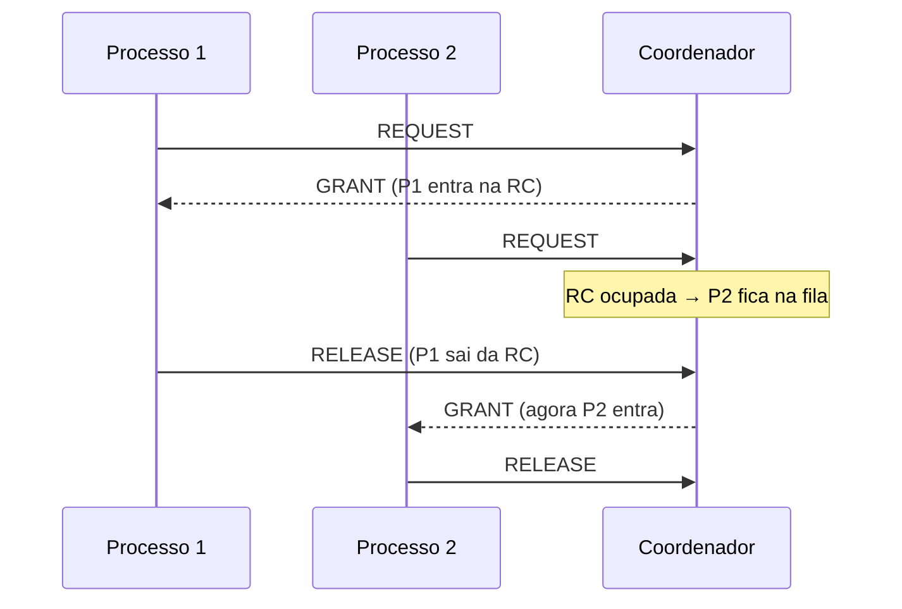

## 1.7 O algoritmo do coordenador (visão alto nível)

O coração do coordenador é decidir o que fazer ao receber cada mensagem. A lógica
é propositalmente simples (detalhada na Fase 3):

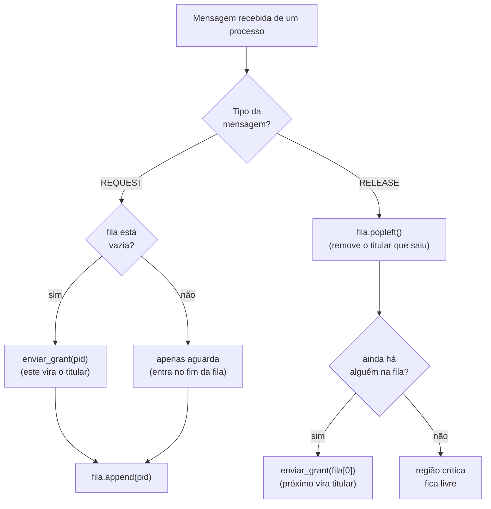

### A decisão de projeto central: fila única

Uma escolha importante do projeto é o **modelo de fila única**: em vez de manter
uma variável separada para "quem está na RC agora", a **cabeça da fila** (`fila_pedidos[0]`)
*é*, por definição, o titular atual. Os demais elementos são quem aguarda.

```python
# coordenador.py, ~linha 20
fila_pedidos: deque[int] = deque()  # cabeça (índice 0) = titular da RC; resto = espera
```

**Por que isso é bom?** Porque deixa o código praticamente idêntico ao
pseudocódigo clássico do algoritmo e elimina o risco de a variável "titular" e a
fila ficarem inconsistentes entre si (uma fonte comum de bugs). No RELEASE, basta
remover a cabeça e conceder ao novo primeiro da fila.

## 1.8 Modelo de threads e concorrência

O enunciado exige que o coordenador seja **multi-threaded**. Usamos **3 threads**,
cada uma com um papel claro:

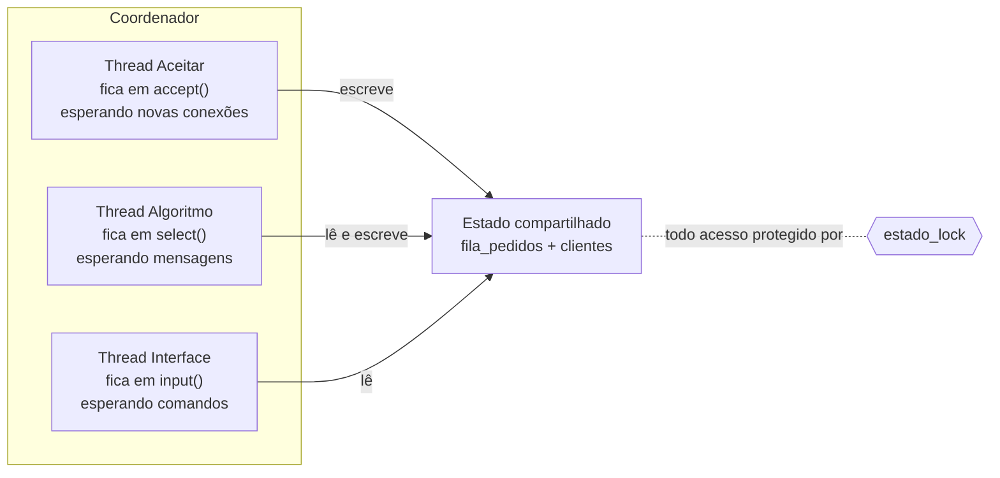

| Thread | Função em `coordenador.py` | O que faz | Onde "dorme" |
|--------|----------------------------|-----------|--------------|
| **Aceitar** | `thread_aceitar` (~linha 55) | Aceita novas conexões TCP e registra o cliente. | Bloqueada em `accept()` |
| **Algoritmo** | `thread_algoritmo` (~linha 79) | Lê REQUEST/RELEASE e responde com GRANT. | Bloqueada em `select()` |
| **Interface** | `thread_interface` (~linha 143) | Processa comandos `fila`, `atendidos`, `sair`. | Bloqueada em `input()` |

### Por que sincronizar com um Lock?

Como **três threads acessam as mesmas estruturas** (`fila_pedidos` e `clientes`),
elas podem tentar modificá-las ao mesmo tempo, causando inconsistências (por
exemplo, duas threads removendo o mesmo item). Para evitar isso, todo acesso ao
estado compartilhado é envolvido por um cadeado (`estado_lock`):

```python
# coordenador.py, ~linha 22
estado_lock = threading.Lock()

# uso típico, ~linha 104
def tratar_request(pid: int) -> None:
    with estado_lock:            # só uma thread por vez entra aqui
        ...
```

> **Curiosidade que responde a uma pergunta clássica do trabalho:**
> *"Quem sincroniza a chegada de pedidos no coordenador?"* — No pseudocódigo de
> laço único, é o próprio `receive()` que serializa (uma mensagem por vez). Na
> nossa versão com várias threads, é o `estado_lock` que garante essa serialização.

---

## ✅ Fim da Fase 1

Cobrimos: o que é o projeto, conceitos, estrutura de arquivos, arquitetura geral,
protocolo (alto nível), fluxos de requisição, o algoritmo do coordenador e o
modelo de threads/sincronização — com 5 diagramas Mermaid.

**Próxima fase (2):** mergulho no `utils.py` — como `serializar`, `parsear` e
`receber_completo` transformam mensagens em bytes e garantem leitura completa
sobre TCP, com exemplos reais byte a byte.

> Confirme com **"pode seguir"** (ou peça ajustes nesta fase) que eu prossigo para a Fase 2.

---

# Fase 2 — `utils.py`: o protocolo de mensagens

O arquivo `utils.py` é a **fundação** do sistema: ele define *como uma mensagem é
representada em bytes* e *como ela é lida de volta*. Tanto o coordenador quanto os
processos importam essas funções, garantindo que os dois lados "falem a mesma
língua". O arquivo tem só 36 linhas, mas cada uma é importante.

## 2.1 As constantes do protocolo

```python
# utils.py, linhas 5-10
F = 16     # Tamanho fixo (em bytes) de toda mensagem
SEP = "|"  # Separador entre campos

MSG_REQUEST = "1"
MSG_GRANT   = "2"
MSG_RELEASE = "3"
```

**O QUE é:** valores constantes usados em todo o sistema.

**POR QUE existem:**

- **`F = 16` (tamanho fixo)** — é a decisão de projeto mais importante deste
  arquivo. Toda mensagem tem **exatamente 16 bytes**, nem mais nem menos. Isso
  resolve um problema clássico de comunicação por sockets: *"como sei que recebi
  uma mensagem inteira?"*. Se o tamanho é fixo, a resposta é trivial: **leia até
  ter 16 bytes** — então você tem uma mensagem completa. (O enunciado do trabalho
  pede exatamente isso.)
- **`SEP = "|"` (separador)** — marca o fim de cada campo dentro da mensagem,
  permitindo separar o identificador da mensagem do identificador do processo.
- **`MSG_REQUEST/GRANT/RELEASE`** — dar **nomes** aos códigos `"1"`, `"2"`, `"3"`
  evita "números mágicos" espalhados pelo código. Escrever
  `if id_msg == MSG_REQUEST` é muito mais legível do que `if id_msg == "1"`.

> **Atenção (tipo dos códigos):** os identificadores são **strings** (`"1"`), não
> inteiros (`1`). Isso é coerente porque a mensagem inteira é tratada como texto
> ASCII. Misturar `"1"` com `1` causaria comparações que nunca dão verdadeiro.

## 2.2 `serializar` — transformar uma mensagem em bytes

```python
# utils.py, linhas 12-16
def serializar(id_msg: str, pid: int) -> bytes:
    """Monta uma mensagem do protocolo com tamanho exato de F bytes"""
    base = f"{id_msg}{SEP}{pid}{SEP}"
    # ljust para preencher o resto com zeros, e encode para transformar em bytes
    return base.ljust(F, "0").encode("ascii")
```

**O QUE faz:** recebe o código da mensagem e o PID, e devolve os **16 bytes**
prontos para enviar pelo socket.

**COMO funciona, passo a passo** (exemplo: `serializar(MSG_REQUEST, 3)`):

| Passo | Código | Resultado | Tamanho |
|-------|--------|-----------|---------|
| 1. Monta o "miolo" | `f"{id_msg}{SEP}{pid}{SEP}"` | `"1|3|"` | 4 caracteres |
| 2. Completa com zeros | `.ljust(F, "0")` | `"1|3|000000000000"` | 16 caracteres |
| 3. Converte para bytes | `.encode("ascii")` | `b"1|3|000000000000"` | 16 bytes |

Visualizando byte a byte o resultado final:

```
índice:  0   1   2   3   4   5   6   7   8   9  10  11  12  13  14  15
byte:   '1' '|' '3' '|' '0' '0' '0' '0' '0' '0' '0' '0' '0' '0' '0' '0'
        └id┘ sep └pid┘sep └────────── preenchimento (padding) ──────────┘
```

**POR QUE cada parte:**

- **`f"..."` (f-string):** monta a string interpolando os valores. Note que `pid`
  é um `int` e a f-string o converte para texto automaticamente (`3` → `"3"`).
- **`.ljust(F, "0")` (left-justify):** alinha o texto à esquerda e preenche o
  **lado direito** com `"0"` até atingir `F` caracteres. É isso que garante o
  tamanho fixo. Os zeros são "lixo de preenchimento" — não têm significado e serão
  ignorados na leitura.
- **`.encode("ascii")`:** sockets transmitem **bytes**, não strings. ASCII é
  suficiente porque só usamos dígitos e o caractere `|`, e tem a vantagem de cada
  caractere ocupar **exatamente 1 byte** — então 16 caracteres = 16 bytes,
  garantindo o tamanho `F` prometido.

> **Limitação honesta:** `ljust` só *adiciona* caracteres; ele **não corta**. Se um
> PID fosse tão grande que `"1|<pid>|"` já passasse de 16 caracteres, a mensagem
> sairia maior que `F` e quebraria a leitura. No nosso uso isso não acontece (os
> PIDs vão de 1 a `n`, valores pequenos), mas é bom saber que o protocolo assume
> PIDs curtos.

## 2.3 `parsear` — transformar bytes de volta em uma mensagem

```python
# utils.py, linhas 18-22
def parsear(dados: bytes) -> tuple[str, int]:
    """Extrai (id_msg, pid) de uma mensagem recebida"""
    texto = dados.decode("ascii")
    partes = texto.split(SEP)
    return partes[0], int(partes[1])
```

**O QUE faz:** é o **inverso** de `serializar`. Recebe os 16 bytes e devolve uma
tupla `(id_msg, pid)`.

**COMO funciona** (exemplo: `parsear(b"1|3|000000000000")`):

| Passo | Código | Resultado |
|-------|--------|-----------|
| 1. Bytes → texto | `dados.decode("ascii")` | `"1|3|000000000000"` |
| 2. Quebra nos separadores | `texto.split(SEP)` | `["1", "3", "000000000000"]` |
| 3. Devolve id e pid | `partes[0], int(partes[1])` | `("1", 3)` |

**POR QUE cada parte:**

- **`.decode("ascii")`:** o oposto de `encode` — transforma os bytes recebidos de
  volta em string de texto.
- **`.split(SEP)`:** corta a string em pedaços a cada `"|"`. O terceiro pedaço
  (`"000000000000"`, o padding) simplesmente **não é usado** — pegamos apenas
  `partes[0]` e `partes[1]`.
- **`int(partes[1])`:** o PID volta a ser um **número inteiro**, pronto para ser
  usado como chave em dicionários e na fila. Repare na simetria: `serializar`
  recebe `pid: int`, `parsear` devolve `pid: int`.

> **Fragilidade conhecida (importante):** se `dados` for `None` — o que acontece
> quando a conexão é fechada — a linha `dados.decode(...)` quebra com erro, pois
> `None` não tem `.decode`. Por isso, quem chama `parsear` deve **antes** verificar
> se os dados não são `None` (veja `receber_completo` a seguir e o uso na Fase 3).

## 2.4 `receber_completo` — ler uma mensagem inteira do socket

Esta é a função mais sutil do arquivo, e existe por causa de uma característica
**fundamental do TCP** que confunde muitos iniciantes.

```python
# utils.py, linhas 24-35
def receber_completo(sock) -> bytes | None:
    """Essa função garante que recebemos exatamente F bytes, mesmo que o recv retorne menos. Retorna None se a conexão for fechada."""
    buffer = b""
    while len(buffer) < F:
        try:
            pedaco = sock.recv(F - len(buffer))
        except (ConnectionResetError, OSError):
            return None
        if not pedaco:
            return None
        buffer += pedaco
    return buffer
```

### O problema que ela resolve

No TCP, quando você pede `sock.recv(16)`, **não há garantia** de receber os 16
bytes de uma vez. O sistema operacional pode te entregar 16, ou 10, ou apenas 3
bytes — o resto chega "depois". Se você simplesmente fizesse `dados = sock.recv(16)`
e passasse para `parsear`, em um dia de azar receberia uma mensagem **pela
metade** e o programa quebraria.

`receber_completo` resolve isso **acumulando** os pedaços até juntar os `F` bytes.

### COMO funciona, passo a passo

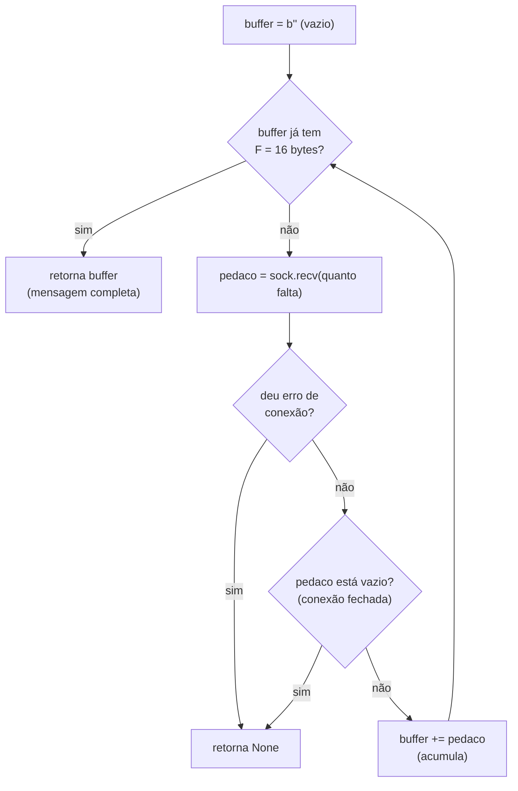

**Detalhe linha a linha:**

- **`buffer = b""`** — começa com um "saco" de bytes vazio.
- **`while len(buffer) < F`** — continua no laço **enquanto** ainda não juntou os
  16 bytes.
- **`sock.recv(F - len(buffer))`** — pede só o que **falta**. Se já tem 10 bytes,
  pede no máximo 6. Isso evita "passar do ponto" e ler parte da próxima mensagem.
- **`except (ConnectionResetError, OSError)`** — se a conexão cair de forma abrupta,
  `recv` lança uma exceção; nós a capturamos e retornamos `None` em vez de deixar o
  programa quebrar.
- **`if not pedaco: return None`** — quando o outro lado **fecha a conexão de forma
  limpa**, `recv` retorna bytes vazios (`b""`). Isso é o sinal padrão de "conexão
  encerrada", e respondemos com `None`.
- **`buffer += pedaco`** — junta o pedaço recebido ao acumulado e volta a testar a
  condição do laço.

### Exemplo prático (recv fragmentado)

Suponha que a mensagem `b"1|3|000000000000"` chegue em **dois pedaços**:

| Iteração | `len(buffer)` antes | `recv` pede | `recv` retorna | `buffer` depois |
|----------|--------------------|-------------|----------------|-----------------|
| 1 | 0 | 16 | `b"1|3|00000"` (7 bytes) | 7 bytes |
| 2 | 7 | 9 | `b"000000000"` (9 bytes) | 16 bytes ✅ |

Na terceira verificação do `while`, `len(buffer)` é 16, o laço termina e a mensagem
completa é devolvida. **O dois lados nunca percebem a fragmentação** — é exatamente
o objetivo da função.

### O valor de retorno `bytes | None`

A assinatura `-> bytes | None` comunica claramente o contrato: a função devolve
**ou** os bytes da mensagem **ou** `None` (sinalizando "conexão acabou"). Isso
permite que o coordenador detecte desconexões de forma elegante:

```python
# coordenador.py, ~linha 88 (uso de receber_completo)
dados = receber_completo(sock)
if dados is None:
    tratar_desconexao(pid_origem, sock)   # cliente caiu → limpa estruturas
    continue
id_msg, pid = parsear(dados)              # só chega aqui se dados é válido
```

## 2.5 Resumo da Fase 2

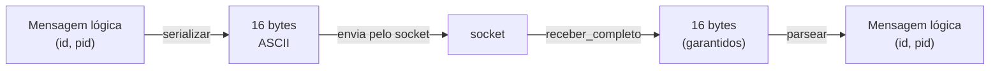

| Função | Direção | Entrada | Saída |
|--------|---------|---------|-------|
| `serializar` | enviar | `(id_msg: str, pid: int)` | `bytes` (16) |
| `receber_completo` | receber | `socket` | `bytes` (16) ou `None` |
| `parsear` | receber | `bytes` (16) | `(id_msg: str, pid: int)` |

Juntas, essas três funções formam um "canal" confiável de mensagens sobre o TCP:
`serializar` + `receber_completo` + `parsear` garantem que cada mensagem enviada
chega inteira e é reinterpretada corretamente do outro lado.

---

## ✅ Fim da Fase 2

Cobrimos todo o `utils.py`: as constantes (`F`, `SEP`, códigos), `serializar`,
`parsear` e `receber_completo` — com exemplos byte a byte, o problema do recv
fragmentado do TCP, as fragilidades conhecidas e 2 diagramas Mermaid.

**Próxima fase (3):** o `coordenador.py` completo — as 3 threads, as funções de
tratamento (`tratar_request`, `tratar_release`, `tratar_desconexao`), o envio de
GRANT, a configuração de log e o `main`, função por função.

> Confirme com **"pode seguir"** (ou peça ajustes) que eu prossigo para a Fase 3.

---

# Fase 3 — `coordenador.py`: o árbitro

Este é o arquivo central do projeto. Ele implementa o **coordenador**: o processo
que recebe os pedidos, mantém a fila e concede o acesso à região crítica, um
processo por vez. Vamos percorrê-lo de cima a baixo, na ordem em que aparece.

> Mapa rápido das funções e onde elas estão:
>
> | Função | Linha aprox. | Papel |
> |--------|--------------|-------|
> | `configurar_log` | 31 | Prepara o arquivo de log |
> | `log` | 41 | Registra um evento (arquivo + terminal) |
> | `enviar_grant` | 45 | Envia a mensagem GRANT a um processo |
> | `thread_aceitar` | 55 | **Thread 1** — aceita conexões |
> | `thread_algoritmo` | 79 | **Thread 2** — roda o algoritmo |
> | `tratar_request` | 102 | Lógica do REQUEST |
> | `tratar_release` | 110 | Lógica do RELEASE |
> | `tratar_desconexao` | 120 | Limpa um cliente que caiu |
> | `thread_interface` | 143 | **Thread 3** — terminal |
> | `main` | 168 | Monta tudo e inicia as threads |

## 3.1 Cabeçalho e imports

```python
# coordenador.py, linhas 8-15
import logging
import selectors
import socket
import threading
import time
from collections import deque
from pathlib import Path
from utils import (MSG_GRANT, MSG_RELEASE, MSG_REQUEST, parsear, receber_completo, serializar)
```

| Import | Para que serve aqui |
|--------|---------------------|
| `logging` | Gravar o log do coordenador em arquivo com horário. |
| `selectors` | Esperar mensagens de **vários** sockets ao mesmo tempo, sem busy-wait. |
| `socket` | Comunicação de rede (servidor TCP). |
| `threading` | Criar as 3 threads e o `Lock` de sincronização. |
| `time` | `time.sleep` na espera quando não há clientes (detalhe na Thread 2). |
| `deque` | A fila de pedidos (uma "fila dupla" eficiente para inserir/remover nas pontas). |
| `Path` | Criar a pasta `logs/` de forma portátil. |
| `utils` | Reaproveita o protocolo de mensagens da Fase 2. |

## 3.2 Estado global (as variáveis compartilhadas)

```python
# coordenador.py, linhas 17-29
HOST = "127.0.0.1"
PORT = 5000

fila_pedidos: deque[int] = deque() # cabeça (índice 0) = titular da RC; resto aguarda
clientes: dict[int, socket.socket] = {} # PID -> socket do cliente
estado_lock = threading.Lock()

atendidos: dict[int, int] = {}

executando = threading.Event() # Controla o loop das threads
executando.set()

seletor = selectors.DefaultSelector()
```

Estas são as estruturas que **todas as threads** compartilham. Entendê-las é a
chave para entender o arquivo inteiro:

| Variável | Tipo | O QUE guarda | POR QUE existe |
|----------|------|--------------|----------------|
| `HOST`, `PORT` | `str`, `int` | Endereço onde o coordenador escuta (`127.0.0.1:5000`). | Os processos precisam saber onde se conectar. |
| `fila_pedidos` | `deque[int]` | PIDs em ordem de chegada; **`[0]` é o titular** da RC. | É o coração do algoritmo (modelo de fila única). |
| `clientes` | `dict[int, socket]` | Mapa **PID → socket**. | Para escrever no socket certo ao enviar um GRANT. |
| `estado_lock` | `threading.Lock` | Um cadeado. | Sincroniza o acesso a `fila_pedidos`/`clientes` entre as threads. |
| `atendidos` | `dict[int, int]` | Quantas vezes cada PID já foi atendido. | Para o comando `atendidos` da interface. |
| `executando` | `threading.Event` | Um sinalizador liga/desliga. | Permite encerrar todas as threads de forma limpa. |
| `seletor` | `DefaultSelector` | Monitor de vários sockets. | Permite à Thread 2 esperar mensagens de qualquer cliente sem gastar CPU. |

> **Sobre `executando` (`threading.Event`):** funciona como um interruptor. `set()`
> liga (loops rodam), `clear()` desliga. Todas as threads checam
> `while executando.is_set()`. Quando o operador digita `sair`, um único
> `executando.clear()` faz todas as threads encerrarem seus laços.

> **Sobre `selectors` em vez de busy-wait:** sem ele, a Thread 2 teria que ficar
> perguntando "tem mensagem? tem mensagem?" em loop, queimando 100% de uma CPU. O
> `selectors` deixa o sistema operacional **avisar** quando algum socket tem dados,
> então a thread dorme até lá. É eficiente e responsivo.

## 3.3 `configurar_log` e `log` — o registro de eventos

```python
# coordenador.py, linhas 31-43
def configurar_log() -> None:
    """Configura o logger para gravar em logs/coordenador.log com timestamp em milissegundos"""
    Path("logs").mkdir(exist_ok=True)
    handler = logging.FileHandler("logs/coordenador.log", mode="w", encoding="utf-8")
    handler.setFormatter(logging.Formatter(fmt="%(asctime)s.%(msecs)03d | %(message)s", datefmt="%H:%M:%S"))
    root = logging.getLogger()
    root.setLevel(logging.INFO)
    root.addHandler(handler)

def log(evento: str) -> None:
    logging.info(evento)
    print(f"[LOG] {evento}")
```

**`configurar_log`** prepara o arquivo de log. Detalhes:

- **`Path("logs").mkdir(exist_ok=True)`** — cria a pasta `logs/`. O `exist_ok=True`
  evita erro se ela já existir.
- **`FileHandler(..., mode="w")`** — abre `logs/coordenador.log` em modo *write*,
  o que **zera o arquivo a cada execução**. Assim cada rodada começa com um log
  limpo (importante para a validação não misturar execuções).
- **`Formatter(fmt="%(asctime)s.%(msecs)03d | %(message)s", datefmt="%H:%M:%S")`** —
  define o formato de cada linha. O `.%(msecs)03d` adiciona os **milissegundos**
  (3 dígitos), exigência do enunciado. Uma linha sai assim:
  `23:50:15.217 | ENVIADO GRANT   -> PID 1`.

**`log`** é um pequeno auxiliar que faz **duas coisas de uma vez**: grava no arquivo
(`logging.info`) **e** imprime no terminal (`print`), para o operador acompanhar o
funcionamento ao vivo.

## 3.4 `enviar_grant` — conceder o acesso

```python
# coordenador.py, linhas 45-52
def enviar_grant(pid: int) -> None:
    """Envia GRANT para o processo `pid` e registra no log. O titular da RC é sempre fila_pedidos[0]."""
    sock = clientes.get(pid)
    if sock is None:
        log(f"Tentativa de enviar GRANT para PID {pid}, mas socket não encontrado.")
        return
    sock.sendall(serializar(MSG_GRANT, pid))
    log(f"ENVIADO GRANT   -> PID {pid}")
```

**O QUE faz:** envia a mensagem `GRANT` ao processo dono do `pid`, autorizando-o a
entrar na região crítica.

**COMO:**

- **`clientes.get(pid)`** — busca o socket daquele PID. Usamos `.get` (em vez de
  `clientes[pid]`) porque ele devolve `None` se a chave não existir, em vez de
  lançar erro.
- **`if sock is None`** — proteção: se o socket sumiu (cliente desconectou), apenas
  registra e sai, sem quebrar.
- **`sock.sendall(serializar(MSG_GRANT, pid))`** — monta os 16 bytes do GRANT (com
  a `serializar` da Fase 2) e envia. `sendall` garante que **todos** os bytes são
  enviados (o equivalente, no envio, do que `receber_completo` faz na leitura).

> **Observação de projeto:** `enviar_grant` **não** mexe na fila. Quem manda na
> fila são as funções `tratar_*`. Aqui a regra é "o titular é sempre
> `fila_pedidos[0]`", então enviar o GRANT é só uma consequência de quem está na
> cabeça. Manter `enviar_grant` "burro" (só envia e loga) evita duplicar a lógica
> da fila.

## 3.5 Thread 1 — `thread_aceitar` (aceitar conexões)

```python
# coordenador.py, linhas 55-76
def thread_aceitar(servidor: socket.socket) -> None:
    """Aceita conexões TCP"""
    while executando.is_set():
        sock_cliente, addr = servidor.accept()

        # Handshake: o cliente manda um REQUEST ao conectar, e o PID vem daí.
        dados = receber_completo(sock_cliente)
        id_msg, pid = parsear(dados)
        if id_msg != MSG_REQUEST:
            log(f"Handshake inválido de {addr}: id={id_msg}")
            sock_cliente.close()
            continue

        with estado_lock:
            clientes[pid] = sock_cliente
            seletor.register(sock_cliente, selectors.EVENT_READ, data=pid)
            log(f"RECEBIDO REQUEST <- PID {pid} (conexão de {addr[0]}:{addr[1]})")
            if not fila_pedidos:        # Q vazia: este PID vira o titular e já recebe o GRANT.
                enviar_grant(pid)
            fila_pedidos.append(pid)    # Entra na fila (na cabeça, se estava vazia).
```

**O QUE faz:** fica em laço aceitando novas conexões. Para cada cliente que conecta,
descobre o PID dele (via um "handshake") e o registra no sistema.

**COMO funciona, passo a passo:**

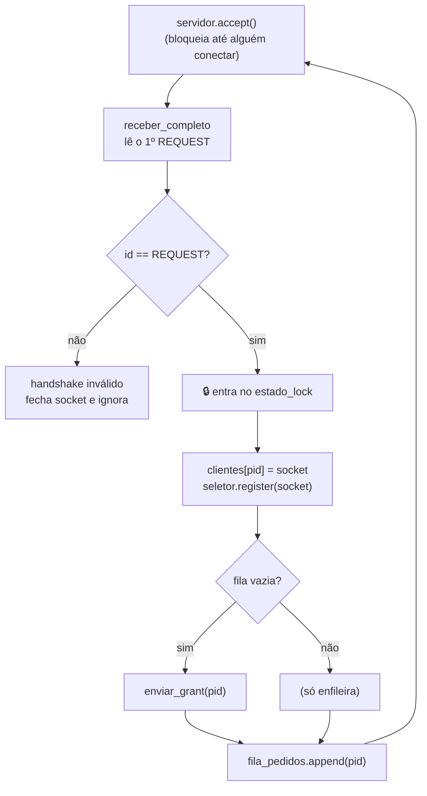

**Detalhes importantes:**

- **`servidor.accept()`** — bloqueia (a thread "dorme") até um processo conectar.
  Retorna o socket dedicado àquele cliente (`sock_cliente`) e o endereço dele (`addr`).
- **O "handshake":** assim que conecta, o cliente já envia um REQUEST. Lemos essa
  primeira mensagem para **descobrir o PID** do cliente — é como ele se "apresenta".
  Se a primeira mensagem não for um REQUEST, consideramos a conexão inválida.
- **`with estado_lock:`** — a partir daqui mexemos em `clientes` e `fila_pedidos`,
  que são compartilhados. O cadeado garante que dois clientes conectando ao mesmo
  tempo não se atropelem.
- **`seletor.register(sock_cliente, EVENT_READ, data=pid)`** — entrega o socket ao
  `selectors`, pedindo para ser avisado quando houver dados para **ler**
  (`EVENT_READ`). O `data=pid` "cola" o PID no socket, para a Thread 2 saber de
  quem é a mensagem depois.
- **A lógica do REQUEST inicial** (`if not fila_pedidos: enviar_grant(pid)` e depois
  `append`) é **exatamente** a do `tratar_request` — porque esse primeiro REQUEST
  do handshake também é um pedido de acesso válido.

> **Fragilidade conhecida (já discutida no projeto):** se um cliente conecta e fecha
> **sem** mandar o REQUEST, `receber_completo` devolve `None` e a linha
> `parsear(dados)` quebra esta thread. No uso normal (sempre via `processo.py`) isso
> não ocorre, mas é um ponto a endurecer se o sistema fosse para produção.

## 3.6 Thread 2 — `thread_algoritmo` (o algoritmo)

```python
# coordenador.py, linhas 79-100
def thread_algoritmo() -> None:
    while executando.is_set():
        if not seletor.get_map():   # Sem sockets registrados, select() daria erro no Windows
            time.sleep(0.5)
            continue
        eventos = seletor.select(timeout=0.5)
        for chave, _ in eventos:
            pid_origem = chave.data
            sock = chave.fileobj
            dados = receber_completo(sock)
            if dados is None:
                tratar_desconexao(pid_origem, sock)
                continue

            id_msg, pid = parsear(dados)

            if id_msg == MSG_REQUEST:
                tratar_request(pid)
            elif id_msg == MSG_RELEASE:
                tratar_release(pid)
            else:
                log(f"Mensagem desconhecida id={id_msg} de PID {pid}")
```

**O QUE faz:** é o laço principal do algoritmo. Espera mensagens de **qualquer**
cliente e despacha cada uma para a função de tratamento correta.

**COMO funciona:**

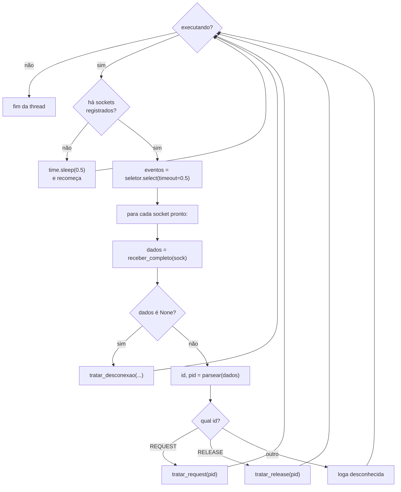

**Detalhes importantes:**

- **`if not seletor.get_map(): time.sleep(0.5)`** — `get_map()` devolve os sockets
  registrados. Se está **vazio** (nenhum cliente ainda), evitamos chamar
  `select()`, porque **no Windows** chamar `select()` com conjunto vazio gera erro
  e mataria a thread. Então a thread só dorme meio segundo e tenta de novo. *(Esse
  guarda foi adicionado justamente para corrigir esse bug no Windows.)*
- **`seletor.select(timeout=0.5)`** — bloqueia até **algum** socket ter dados, ou
  até passar 0,5 s (o `timeout`). O timeout existe para a thread "acordar"
  periodicamente e reavaliar `executando.is_set()` — assim ela percebe um pedido de
  encerramento em no máximo meio segundo.
- **`chave.data` / `chave.fileobj`** — para cada socket pronto, recuperamos o PID
  (`data`, que colamos no `register`) e o próprio socket (`fileobj`).
- **`if dados is None: tratar_desconexao(...)`** — se a leitura indica conexão
  fechada, tratamos a desconexão (limpeza) e seguimos.
- **O `if/elif/else`** — despacha a mensagem: REQUEST e RELEASE têm tratadores
  próprios; qualquer outra coisa é registrada como desconhecida (defensivo).

## 3.7 `tratar_request` — lógica do pedido

```python
# coordenador.py, linhas 102-108
def tratar_request(pid: int) -> None:
    """REQUEST: se a fila Q estava vazia, o pid vira titular e recebe GRANT; em seguida entra na fila."""
    with estado_lock:
        log(f"RECEBIDO REQUEST <- PID {pid}")
        if not fila_pedidos:
            enviar_grant(pid)
        fila_pedidos.append(pid)
```

**O QUE faz:** processa um pedido de acesso.

**A regra (modelo de fila única):**

- **Se a fila está vazia** → ninguém está na RC, então o pedinte **já recebe o
  GRANT** (vira o titular) e entra na fila como cabeça.
- **Se a fila não está vazia** → a RC está ocupada; o pedinte apenas **entra no fim
  da fila** e espera sua vez.

Em ambos os casos a última ação é `fila_pedidos.append(pid)`. Tudo dentro do
`estado_lock`, pois mexe na fila compartilhada.

## 3.8 `tratar_release` — lógica da liberação

```python
# coordenador.py, linhas 110-118
def tratar_release(pid: int) -> None:
    """RELEASE: remove o titular (cabeça da fila Q) e passa o GRANT para o próximo, se houver."""
    with estado_lock:
        log(f"RECEBIDO RELEASE <- PID {pid}")
        atendidos[pid] = atendidos.get(pid, 0) + 1
        if fila_pedidos:
            fila_pedidos.popleft()          # Remove o titular que acabou de liberar
        if fila_pedidos:
            enviar_grant(fila_pedidos[0])   # O novo titular é a nova cabeça da fila
```

**O QUE faz:** processa a saída de um processo da RC e passa a vez ao próximo.

**COMO:**

- **`atendidos[pid] = atendidos.get(pid, 0) + 1`** — contabiliza mais um
  atendimento concluído para aquele PID (para o comando `atendidos`). O
  `.get(pid, 0)` trata o primeiro RELEASE de um PID (quando ele ainda não está no
  dicionário, assume 0).
- **`fila_pedidos.popleft()`** — remove a **cabeça**, que é justamente o processo
  que estava na RC e acabou de liberar (`Q.remove()` do pseudocódigo).
- **`if fila_pedidos: enviar_grant(fila_pedidos[0])`** — se ainda há gente
  esperando, o **novo primeiro da fila** vira titular e recebe o GRANT. Senão, a RC
  fica livre.

> **Por que dois `if fila_pedidos` seguidos?** O primeiro protege o `popleft` (não
> dá para remover de uma fila vazia). O segundo verifica se, **após** remover o
> titular, **sobrou** alguém para receber o próximo GRANT. São checagens de momentos
> diferentes.

## 3.9 `tratar_desconexao` — limpar um cliente que caiu

```python
# coordenador.py, linhas 120-139
def tratar_desconexao(pid: int, sock: socket.socket) -> None:
    """Remove cliente caído das estruturas. Se ele era o titular, passa o GRANT adiante."""
    with estado_lock:
        log(f"DESCONEXÃO    <- PID {pid}")
        try:
            seletor.unregister(sock)
        except (KeyError, ValueError):
            pass
        try:
            sock.close()
        except OSError:
            pass
        clientes.pop(pid, None)

        era_titular = bool(fila_pedidos) and fila_pedidos[0] == pid
        if pid in fila_pedidos:
            fila_pedidos.remove(pid)

        if era_titular and fila_pedidos:
            enviar_grant(fila_pedidos[0])
```

**O QUE faz:** lida com um processo que caiu (fechou a conexão), garantindo que o
sistema **não trave** por causa disso.

**COMO, passo a passo:**

- **`seletor.unregister(sock)`** — para de monitorar aquele socket. Envolto em
  `try/except` porque, se já tiver sido removido, não queremos quebrar.
- **`sock.close()`** — libera o recurso do socket (também protegido).
- **`clientes.pop(pid, None)`** — remove o PID do mapa de clientes. O segundo
  argumento `None` evita erro caso a chave já não exista.
- **`era_titular = ... fila_pedidos[0] == pid`** — calcula **antes de remover** se o
  processo que caiu era quem estava na RC. Essa ordem importa: precisamos saber o
  estado anterior à remoção.
- **`if pid in fila_pedidos: fila_pedidos.remove(pid)`** — tira o PID da fila, esteja
  ele na cabeça (era titular) ou no meio (estava esperando).
- **`if era_titular and fila_pedidos: enviar_grant(fila_pedidos[0])`** — se quem caiu
  **detinha** a RC, ela ficaria órfã para sempre; então passamos o GRANT ao próximo.
  Se o que caiu só estava esperando, não há GRANT a refazer.

> **Por que isso é importante:** sem este tratamento, a queda do titular deixaria a
> RC eternamente "ocupada" por um fantasma, e **todos** os outros processos ficariam
> presos na fila para sempre (deadlock).

## 3.10 Thread 3 — `thread_interface` (terminal)

```python
# coordenador.py, linhas 143-166
def thread_interface() -> None:
    print("Interface do coordenador ativa.")
    print("Comandos: fila | atendidos | sair")
    while executando.is_set():
        try:
            cmd = input("> ").strip().lower()
        except (EOFError, KeyboardInterrupt):
            cmd = "sair"

        if cmd == "fila":
            with estado_lock:
                titular = fila_pedidos[0] if fila_pedidos else None
                print(f"  titular atual: {titular}")
                print(f"  fila de espera: {list(fila_pedidos)[1:]}")
        elif cmd == "atendidos":
            print(f"  atendimentos por PID: {dict(atendidos)}")
        elif cmd == "sair":
            print("Encerrando coordenador...")
            executando.clear()
            break
        elif cmd == "":
            continue
        else:
            print(f"  comando desconhecido: '{cmd}'")
```

**O QUE faz:** oferece um terminal interativo para o operador inspecionar e
encerrar o sistema. Atende os três comandos exigidos pelo enunciado.

| Comando | O que faz |
|---------|-----------|
| `fila` | Mostra o **titular** (`fila_pedidos[0]`) e a **fila de espera** (o resto, `[1:]`). Lê sob `estado_lock` para ver um retrato consistente. |
| `atendidos` | Mostra o dicionário `atendidos` (quantas vezes cada PID já foi servido). |
| `sair` | Imprime aviso, faz `executando.clear()` (desliga o interruptor de todas as threads) e sai do laço. |

**Detalhes:**

- **`input("> ")`** — bloqueia esperando o operador digitar. É por isso que a
  interface precisa de uma **thread própria**: ela passa a vida parada aqui, sem
  atrapalhar o algoritmo.
- **`.strip().lower()`** — remove espaços e ignora maiúsculas/minúsculas (`SAIR`,
  `sair`, ` Sair ` são tratados igual).
- **`except (EOFError, KeyboardInterrupt)`** — se o operador apertar `Ctrl+C` ou o
  terminal fechar (fim de entrada), tratamos como `"sair"` para encerrar com
  elegância.
- **`cmd == ""`** — se o operador só apertou Enter, ignora e mostra o prompt de novo.

## 3.11 `main` — montagem e inicialização

```python
# coordenador.py, linhas 168-197
def main() -> None:
    configurar_log()

    servidor = socket.socket(socket.AF_INET, socket.SOCK_STREAM)
    servidor.setsockopt(socket.SOL_SOCKET, socket.SO_REUSEADDR, 1)
    servidor.bind((HOST, PORT))
    servidor.listen()
    print(f"Coordenador escutando em {HOST}:{PORT}")
    log(f"Coordenador iniciado em {HOST}:{PORT}")

    t_aceitar = threading.Thread(target=thread_aceitar, args=(servidor,),
                                 name="aceitar", daemon=True)
    t_algoritmo = threading.Thread(target=thread_algoritmo,
                                   name="algoritmo", daemon=True)
    t_aceitar.start()
    t_algoritmo.start()

    try:
        thread_interface()
    finally:
        with estado_lock:
            for sock in list(clientes.values()):
                try:
                    sock.close()
                except OSError:
                    pass
        try:
            servidor.close()
        except OSError:
            pass
```

**O QUE faz:** é o "maestro" — prepara o servidor, sobe as threads e cuida do
encerramento limpo.

**COMO, passo a passo:**

- **`configurar_log()`** — primeira coisa: prepara o log.
- **Criação do socket servidor:**
  - `socket.AF_INET, socket.SOCK_STREAM` → socket TCP sobre IPv4.
  - `setsockopt(..., SO_REUSEADDR, 1)` → permite reusar a porta imediatamente após
    um encerramento, evitando o erro "endereço já em uso" ao reiniciar rápido.
  - `bind((HOST, PORT))` → "amarra" o socket ao endereço `127.0.0.1:5000`.
  - `listen()` → coloca o socket em modo de escuta, pronto para aceitar conexões.
- **Criação das threads:**
  - `thread_aceitar` recebe o `servidor` como argumento (`args=(servidor,)`).
  - **`daemon=True`** — marca as threads como *daemon*: quando a thread principal
    terminar, elas são encerradas junto automaticamente. Sem isso, o programa
    poderia "travar" no fim esperando-as.
  - Note que **só duas** threads são criadas explicitamente. A terceira (interface)
    roda na **própria thread principal**, ao chamar `thread_interface()` logo abaixo.
- **`try/finally`** — quando `thread_interface()` retorna (operador digitou `sair`),
  o bloco `finally` **sempre** executa a limpeza: fecha todos os sockets dos clientes
  e o socket servidor, liberando os recursos de rede.

### Linha de execução das threads

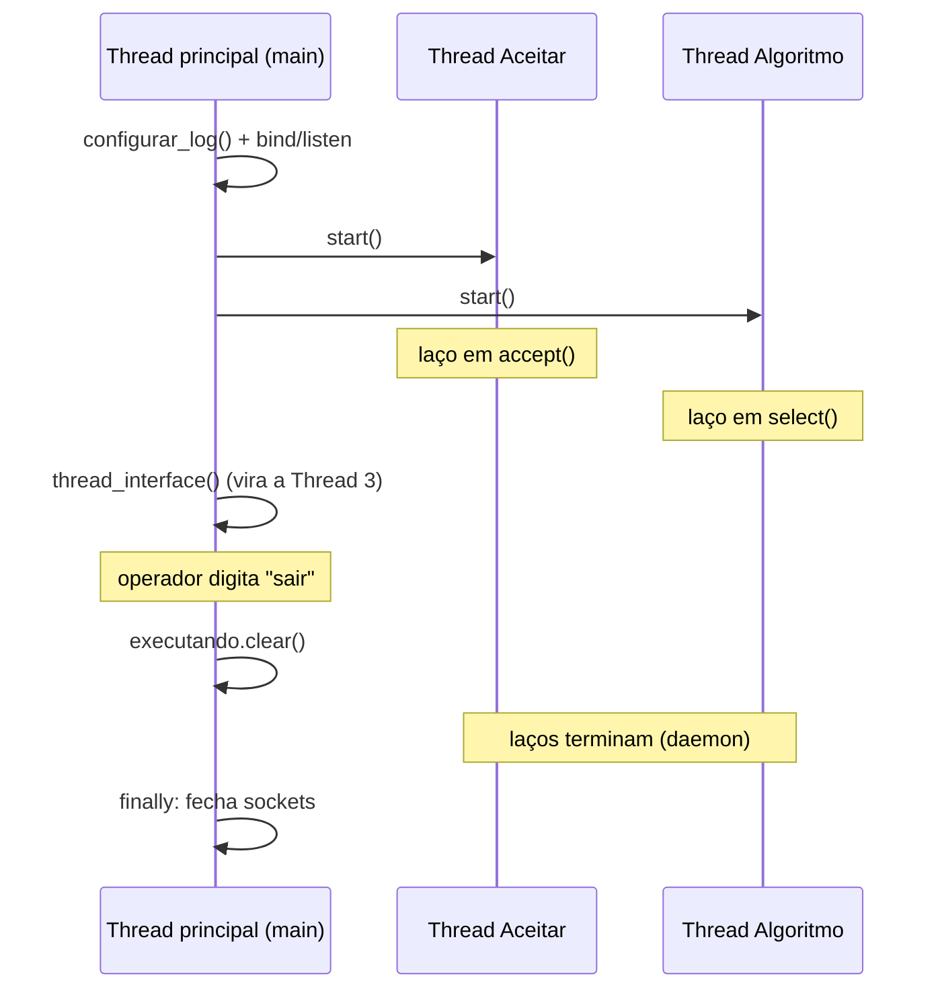

## 3.12 Ponto de entrada

```python
# coordenador.py, linhas 199-200
if __name__ == "__main__":
    main()
```

Esse padrão clássico do Python garante que `main()` só roda quando o arquivo é
**executado diretamente** (`python coordenador.py`), e **não** quando é importado
por outro módulo. (É exatamente por isso que `executar.py` pode importar coisas sem
disparar o coordenador sem querer.)

---

## ✅ Fim da Fase 3

Cobrimos `coordenador.py` inteiro: imports, estado global compartilhado, log,
`enviar_grant`, as **3 threads** (`thread_aceitar`, `thread_algoritmo`,
`thread_interface`), os tratadores (`tratar_request`, `tratar_release`,
`tratar_desconexao`), o `main` e o ponto de entrada — com 4 diagramas Mermaid e as
fragilidades conhecidas anotadas com honestidade.

**Próxima fase (4):** o `processo.py` — o cliente que pede acesso, executa a região
crítica e libera, repetindo `r` vezes.

> Confirme com **"pode seguir"** (ou peça ajustes) que eu prossigo para a Fase 4.

---

# Fase 4 — `processo.py`: o cliente

Enquanto o coordenador é o árbitro, o `processo.py` é o **jogador**: ele representa
um único processo que repetidamente pede acesso à região crítica, escreve no
arquivo compartilhado e libera. São apenas duas funções: `run_processo` (o ciclo
completo) e `esperar_grant` (um auxiliar de leitura).

## 4.1 Cabeçalho, imports e constantes

```python
# processo.py, linhas 1-10
import socket
import time
from datetime import datetime

from utils import (MSG_GRANT, MSG_RELEASE, MSG_REQUEST, parsear, receber_completo, serializar)

HOST = "127.0.0.1"
PORT = 5000

ARQUIVO_RESULTADO = "resultado.txt"
```

| Item | Para que serve |
|------|----------------|
| `socket` | Abrir a conexão TCP com o coordenador. |
| `time` | `time.sleep(k)` — a pausa de `k` segundos a cada iteração. |
| `datetime` | Obter a hora atual com milissegundos para escrever na RC. |
| `utils` | O mesmo protocolo de mensagens da Fase 2 (lado do cliente). |
| `HOST`, `PORT` | Endereço do coordenador — **idênticos** aos do `coordenador.py`, pois o cliente precisa saber onde se conectar. |
| `ARQUIVO_RESULTADO` | Nome do arquivo compartilhado (`resultado.txt`) — o recurso protegido pela exclusão mútua. |

## 4.2 `run_processo` — o ciclo de vida completo

```python
# processo.py, linhas 12-35
def run_processo(pid: int, r: int, k: float) -> None:
    """Roda o ciclo completo de um processo cliente."""
    sock = socket.socket(socket.AF_INET, socket.SOCK_STREAM)
    sock.connect((HOST, PORT)) # Conecta com o coordenador

    try:
        for i in range(r):
            time.sleep(k) # Dormindo antes de pedir acesso à RC

            sock.sendall(serializar(MSG_REQUEST, pid)) # Envia REQUEST (acesso à RC)

            esperar_grant(sock, pid) # Espera até receber GRANT para este PID

            # REGIÃO CRÍTICA
            agora = datetime.now().strftime("%H:%M:%S.%f")[:-3]  # ms
            with open(ARQUIVO_RESULTADO, "a", encoding="utf-8") as f:
                f.write(f"PID {pid} | {agora}\n")

            sock.sendall(serializar(MSG_RELEASE, pid))
    finally:
        try:
            sock.close()
        except OSError:
            pass
```

**O QUE faz:** executa o ciclo inteiro de um processo — conectar, repetir `r` vezes
o pedido/uso/liberação da RC, e ao final fechar a conexão.

**Os três parâmetros** (vêm do enunciado do trabalho):

| Parâmetro | Significado |
|-----------|-------------|
| `pid` | Identificador deste processo (1, 2, 3, ...). |
| `r` | Quantas **vezes** ele vai repetir o ciclo de entrar na RC. |
| `k` | Quantos **segundos** ele dorme antes de cada pedido. |

**COMO funciona, passo a passo:**

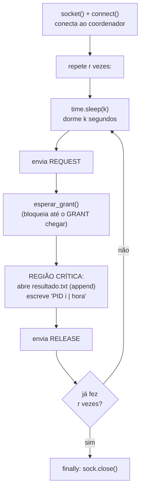

**Detalhes importantes:**

- **`socket.socket(AF_INET, SOCK_STREAM)` + `connect((HOST, PORT))`** — abre **um
  único** socket TCP e conecta ao coordenador. Cada processo tem exatamente um
  socket (diferente do coordenador, que mantém vários).
- **`for i in range(r)`** — repete o ciclo `r` vezes, como pede o enunciado.
- **`time.sleep(k)` ANTES do REQUEST** — a pausa acontece **no começo** de cada
  iteração. Isso espalha os pedidos no tempo e simula um trabalho fora da RC. Com
  `k` grande, os processos disputam menos; com `k = 0`, eles "atacam" o coordenador
  sem pausa (cenário de estresse).
- **`sock.sendall(serializar(MSG_REQUEST, pid))`** — pede acesso. O `sendall`
  garante o envio dos 16 bytes completos.
- **`esperar_grant(sock, pid)`** — **bloqueia** o processo até o coordenador
  responder com o GRANT dele (detalhado em 4.3). É aqui que o processo "espera na
  fila", se houver disputa.
- **A REGIÃO CRÍTICA** — só se executa **depois** do GRANT, garantindo a exclusão
  mútua:
  - `datetime.now().strftime("%H:%M:%S.%f")[:-3]` → pega a hora atual. O `%f` dá
    **microssegundos** (6 dígitos); o `[:-3]` corta os 3 últimos, deixando
    **milissegundos** (3 dígitos), como exige o enunciado.
  - `open(ARQUIVO_RESULTADO, "a", ...)` → abre em modo **append** (`"a"`), ou seja,
    **acrescenta no final** sem apagar o que já existe. Por isso todos os processos
    podem escrever no mesmo arquivo.
  - `f.write(f"PID {pid} | {agora}\n")` → grava uma linha como `PID 3 | 23:50:15.263`.
- **`sock.sendall(serializar(MSG_RELEASE, pid))`** — avisa o coordenador que saiu da
  RC, liberando-a para o próximo.
- **`try/finally` com `sock.close()`** — garante que o socket seja **sempre** fechado
  ao terminar, mesmo se algo der errado no meio do laço.

> **Integração com o coordenador (detalhe sutil):** o **primeiro** REQUEST enviado
> por este processo é consumido pelo coordenador como o "handshake" (lá na
> `thread_aceitar`, Fase 3.5), que descobre o PID e já registra o cliente. Os
> envios seguintes (RELEASE, e os REQUEST das próximas iterações) são lidos pela
> `thread_algoritmo`. Do ponto de vista do `processo.py`, no entanto, é tudo igual:
> ele apenas envia REQUEST e espera o GRANT, sem saber dessa divisão interna.

## 4.3 `esperar_grant` — aguardar a vez

```python
# processo.py, linhas 37-45
def esperar_grant(sock: socket.socket, pid_esperado: int) -> None:
    """Lê do socket até receber um GRANT para `pid_esperado`."""
    while True: # Fica em loop lendo do socket até receber o GRANT para este PID
        dados = receber_completo(sock)

        id_msg, pid_msg = parsear(dados)

        if id_msg == MSG_GRANT and pid_msg == pid_esperado:
            return
```

**O QUE faz:** fica lendo mensagens do socket até receber **o GRANT destinado a
este processo**, e só então retorna (liberando o `run_processo` para entrar na RC).

**COMO:**

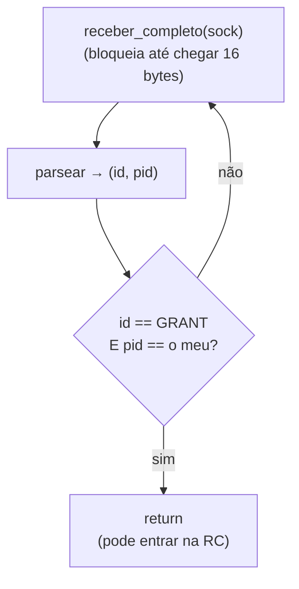

**Detalhes:**

- **`while True`** — laço "infinito" que só termina com o `return`. Como o processo
  não pode fazer nada antes do GRANT, faz sentido ficar bloqueado aqui.
- **`receber_completo(sock)`** — usa a função robusta da Fase 2: bloqueia até obter
  uma mensagem inteira de 16 bytes.
- **`if id_msg == MSG_GRANT and pid_msg == pid_esperado`** — confere **duas** coisas:
  que a mensagem é um GRANT **e** que ele é endereçado a este PID. Essa dupla
  checagem é uma **defesa**: o coordenador só envia GRANT para o PID correto neste
  socket, mas a verificação garante que o processo nunca entre na RC por engano.

> **Fragilidade conhecida (coerente com a Fase 2):** `esperar_grant` chama
> `parsear(dados)` **sem** antes checar se `dados` é `None`. Se o coordenador cair e
> a conexão fechar enquanto o processo espera, `receber_completo` devolve `None` e o
> `parsear` quebra. No fluxo normal (coordenador sempre ativo) isso não ocorre, mas
> é um ponto a endurecer numa versão mais robusta.

## 4.4 Por que `processo.py` não tem um `if __name__ == "__main__"`?

Diferente do `coordenador.py`, este arquivo **não** é feito para rodar sozinho:
ele é uma "biblioteca" cuja função `run_processo` é **importada e disparada** pelo
`executar.py` (que cria `n` processos de uma vez). Veremos isso na Fase 5.

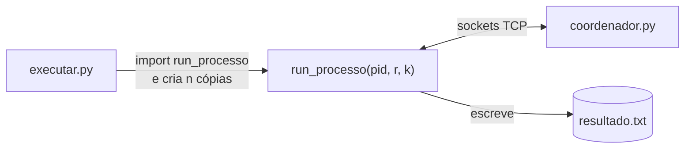

---

## ✅ Fim da Fase 4

Cobrimos todo o `processo.py`: imports e constantes, `run_processo` (o ciclo
conectar → repetir `r` vezes [dormir → REQUEST → esperar GRANT → RC → RELEASE] →
fechar) e `esperar_grant` (o laço de espera com dupla checagem) — com 3 diagramas
Mermaid, o detalhe de integração do handshake e as fragilidades conhecidas.

**Próxima fase (5):** `executar.py` e `validar.py` — como o experimento é lançado
(vários processos de uma vez) e como o resultado e o log são validados
automaticamente.

> Confirme com **"pode seguir"** (ou peça ajustes) que eu prossigo para a Fase 5.

---

# Fase 5 — `executar.py` e `validar.py`: orquestração e validação

Estes dois arquivos são as ferramentas de **medição e avaliação** exigidas pelo
enunciado. O `executar.py` lança o experimento (sobe `n` processos de uma vez); o
`validar.py` confere automaticamente se tudo funcionou corretamente.

## Parte A — `executar.py` (o lançador)

### 5.1 Imports e constante

```python
# executar.py, linhas 5-11
import argparse
from pathlib import Path
from multiprocessing import Process
from processo import run_processo
from validar import validar_log, validar_resultado

ARQUIVO_RESULTADO = "resultado.txt"
```

| Item | Para que serve |
|------|----------------|
| `argparse` | Ler os parâmetros `--n`, `--r`, `--k` da linha de comando. |
| `Path` | Zerar o `resultado.txt` antes de começar. |
| `multiprocessing.Process` | Criar **processos de verdade** (não threads) para os clientes. |
| `run_processo` | A função do cliente (Fase 4) que cada processo vai executar. |
| `validar_log`, `validar_resultado` | As validações (Parte B) chamadas ao final. |

> **Por que `multiprocessing` e não `threading`?** O enunciado pede que "diferentes
> processos executem na mesma máquina". `multiprocessing.Process` cria processos do
> sistema operacional **de verdade**, com memória separada — o cenário realista de
> exclusão mútua distribuída. Threads compartilhariam memória, descaracterizando o
> problema.

### 5.2 `run_experimento` — o coração do lançador

```python
# executar.py, linhas 13-32
def run_experimento(n: int, r: int, k: float) -> None:
    # Zerando o arquivo de resultado para o experimento atual
    Path(ARQUIVO_RESULTADO).write_text("", encoding="utf-8")

    print(f"=== Experimento: n={n} processos, r={r} repetições, k={k}s ===")
    print("(certifique-se que o coordenador.py já está rodando)\n")

    procs = [
        Process(target=run_processo, args=(pid, r, k), name=f"P{pid}")
        for pid in range(1, n + 1)
    ]
    for p in procs:
        p.start()
    for p in procs:
        p.join()

    print("\n=== Todos os processos terminaram ===")

    validar_resultado(n, r)
    validar_log()
```

**O QUE faz:** prepara o ambiente, lança os `n` processos simultaneamente, espera
todos terminarem e dispara a validação.

**COMO, passo a passo:**

- **`Path(ARQUIVO_RESULTADO).write_text("")`** — **zera** o `resultado.txt`. Cada
  experimento começa com o arquivo limpo, senão as linhas de execuções antigas se
  misturariam e a contagem (`n*r` linhas) falharia.
- **Criação dos processos (list comprehension):** cria uma lista de `Process`, um
  para cada PID de `1` a `n`. Cada um vai rodar `run_processo(pid, r, k)`. O
  `name=f"P{pid}"` só dá um nome amigável ao processo.
- **`for p in procs: p.start()`** — **inicia todos** os processos, um atrás do
  outro, sem retardo (como pede o enunciado: "iniciados sequencialmente, sem
  retardo"). A partir daqui, eles rodam em paralelo e disputam a RC.
- **`for p in procs: p.join()`** — **espera** cada processo terminar (`join`
  bloqueia até o processo acabar). Só passamos adiante quando **todos** concluíram
  suas `r` repetições.
- **`validar_resultado(n, r)` e `validar_log()`** — ao final, valida automaticamente
  o resultado e o log (Parte B).

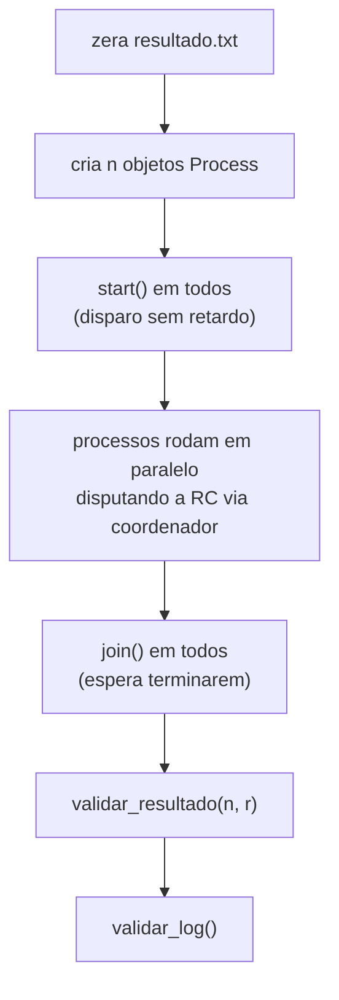

### 5.3 `main` — a interface de linha de comando

```python
# executar.py, linhas 34-40
def main() -> None:
    parser = argparse.ArgumentParser(description="Experimento de exclusão mútua")
    parser.add_argument("--n", type=int, default=5, help="número de processos")
    parser.add_argument("--r", type=int, default=3, help="repetições por processo")
    parser.add_argument("--k", type=float, default=1.0, help="sleep antes do REQUEST (segundos)")
    args = parser.parse_args()
    run_experimento(args.n, args.r, args.k)
```

**O QUE faz:** lê os parâmetros do experimento da linha de comando, com **valores
padrão**, e chama `run_experimento`.

| Argumento | Tipo | Padrão | Significado |
|-----------|------|--------|-------------|
| `--n` | int | 5 | número de processos |
| `--r` | int | 3 | repetições por processo |
| `--k` | float | 1.0 | segundos de pausa antes de cada REQUEST |

Assim, `python executar.py` roda o padrão (5, 3, 1.0), e
`python executar.py --n 10 --r 5 --k 0.5` personaliza o cenário.

## Parte B — `validar.py` (o validador automático)

Este arquivo confere, **sem intervenção humana**, se o experimento respeitou todas
as propriedades de corretude. Tem duas validações independentes.

### 5.4 `validar_resultado` — confere o `resultado.txt`

```python
# validar.py, linhas 14-61 (trechos principais)
def validar_resultado(n: int, r: int) -> bool:
    linhas = caminho.read_text(encoding="utf-8").splitlines()
    esperado = n * r
    # 1) número de linhas
    if len(linhas) == esperado: ...        # OK / FALHA
    # 2) ordem cronológica e contagem por PID
    contagem = Counter()
    ultimo_ts = None
    for i, linha in enumerate(linhas, start=1):
        m = re.match(r"PID (\d+) \| (\d{2}:\d{2}:\d{2}\.\d+)", linha)
        pid = int(m.group(1))
        ts = datetime.strptime(m.group(2), "%H:%M:%S.%f")
        contagem[pid] += 1
        if ultimo_ts is not None and ts < ultimo_ts:
            print("FALHA: timestamp fora de ordem ...")
        ultimo_ts = ts
    # 3) cada PID executou exatamente r vezes
```

**O QUE verifica** (as três propriedades exigidas pelo enunciado):

1. **Número de linhas = `n × r`** — se 5 processos repetem 3 vezes, o arquivo deve
   ter exatamente 15 linhas. Mais ou menos que isso indica erro.
2. **Ordem cronológica** — percorre as linhas comparando o carimbo de tempo de cada
   uma com o da anterior (`if ts < ultimo_ts`). Como a RC é serializada, os
   horários **nunca** podem "andar para trás".
3. **Cada PID escreveu `r` vezes** — usa um `Counter` para contar as ocorrências de
   cada PID e confere se todos bateram `r`.

**Ferramentas usadas:**

- **`re.match(r"PID (\d+) \| (\d{2}:\d{2}:\d{2}\.\d+)", linha)`** — uma *expressão
  regular* que valida o **formato** da linha e extrai dois grupos: o PID (`\d+`) e o
  horário. Se a linha estiver malformada, `m` é `None` e a validação acusa falha.
- **`datetime.strptime(..., "%H:%M:%S.%f")`** — converte o texto do horário de volta
  em um objeto de data/hora, permitindo **comparar** dois horários com `<`.
- **`Counter`** — um dicionário especializado em contagem, do módulo `collections`.

### 5.5 `validar_log` — confere os invariantes de exclusão mútua

```python
# validar.py, linhas 63-110 (trechos principais)
def validar_log() -> bool:
    padrao = re.compile(r"(RECEBIDO REQUEST|ENVIADO GRANT|RECEBIDO RELEASE).*?PID (\d+)")
    eventos = [...]  # extrai (tipo, pid) de cada linha do log

    titular = None
    pids_grant_em_ordem = []
    pids_release_em_ordem = []
    for evento, pid in eventos:
        if evento == "ENVIADO GRANT":
            if titular is not None:        # já havia um titular!
                print("FALHA: GRANT sem RELEASE intermediário")
            titular = pid
            pids_grant_em_ordem.append(pid)
        elif evento == "RECEBIDO RELEASE":
            if titular != pid:             # quem libera não é o titular!
                print("FALHA: RELEASE de PID que não era o titular")
            titular = None
            pids_release_em_ordem.append(pid)

    # ao final: a ordem dos GRANT deve ser igual à ordem dos RELEASE
```

**O QUE verifica** (lendo `logs/coordenador.log`):

1. **Exclusão mútua (GRANT/RELEASE intercalados):** o validador "simula" o estado do
   titular. Sempre que vê um `GRANT`, o titular **deveria** estar livre (`None`); se
   já houvesse um titular, significa que dois processos teriam acesso ao mesmo tempo
   — violação grave. A cada `RELEASE`, confere ainda que **quem libera é realmente o
   titular** atual.
2. **Ordem GRANT = ordem RELEASE:** guarda a sequência de PIDs que receberam GRANT e
   a sequência dos que enviaram RELEASE; ao final, exige que sejam **idênticas** —
   confirmando o comportamento FIFO (quem entra primeiro, sai primeiro).

**Ferramenta usada:**

- **`re.compile(r"(RECEBIDO REQUEST|ENVIADO GRANT|RECEBIDO RELEASE).*?PID (\d+)")`** —
  uma regex que reconhece as três frases de evento no log e captura o **tipo** e o
  **PID**. O `re.compile` "pré-compila" o padrão para reusá-lo em todas as linhas
  com eficiência.

### 5.6 `main` de `validar.py` — validar sem reexecutar

```python
# validar.py, linhas 113-125
def main() -> None:
    parser = argparse.ArgumentParser()
    parser.add_argument("--n", type=int, required=True)
    parser.add_argument("--r", type=int, required=True)
    args = parser.parse_args()
    r1 = validar_resultado(args.n, args.r)
    r2 = validar_log()
    if r1 and r2:
        print(">>> TODAS AS VALIDAÇÕES PASSARAM <<<")
    else:
        print(">>> HOUVE FALHAS — ver mensagens acima <<<")
```

Isso permite **revalidar** um experimento já rodado, sem executá-lo de novo:
`python validar.py --n 5 --r 3`. Aqui `--n` e `--r` são `required=True` (sem padrão),
pois sem eles não há como saber quantas linhas/execuções esperar.

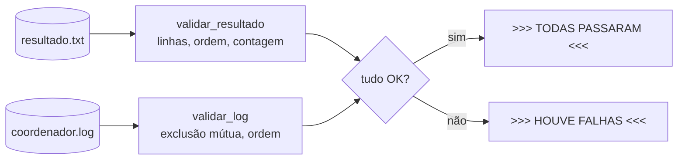

---

## ✅ Fim da Fase 5

Cobrimos `executar.py` (lançamento de `n` processos com `multiprocessing`, e por
que processos e não threads) e `validar.py` (as duas validações: `resultado.txt`
por número de linhas/ordem/contagem, e o log por exclusão mútua/ordem FIFO) — com
2 diagramas Mermaid.

---

# Fase 6 — Execução, cenários de teste e problemas conhecidos

Esta fase é o **guia prático**: como colocar o sistema para rodar, como testá-lo
em diferentes cenários e quais problemas conhecidos existem.

## 6.1 Pré-requisitos

- **Python 3** (o projeto usa *type hints* modernos, como `int | None` — recomendado
  Python 3.10+).
- **Nenhuma biblioteca externa** é necessária para rodar o sistema em si
  (`coordenador.py`, `processo.py`, `executar.py`, `validar.py` usam só a biblioteca
  padrão). As bibliotecas `python-docx` e `matplotlib` só foram usadas para **gerar
  o relatório** (ver 6.5), não para o funcionamento.

## 6.2 Como rodar (fluxo de dois terminais)

O coordenador tem uma interface interativa de terminal, então ele ocupa um terminal
sozinho. Os processos rodam em outro.

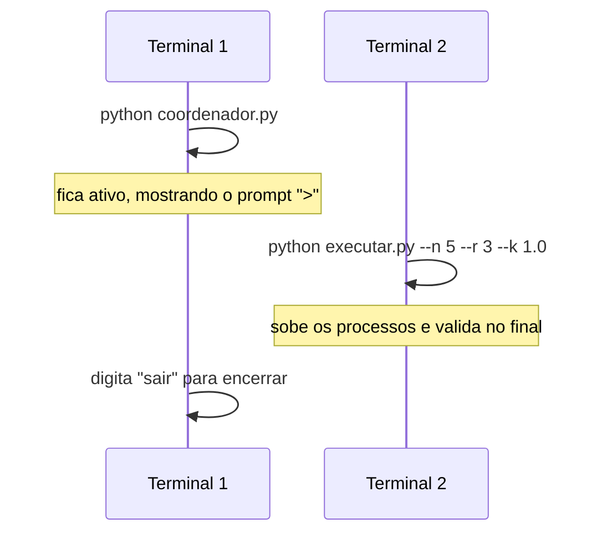

**Terminal 1 — sobe o coordenador (deixe aberto):**

```powershell
python coordenador.py
```

Aparece o prompt `>`. Os comandos disponíveis (atendidos pela `thread_interface`):

| Comando | O que mostra/faz |
|---------|------------------|
| `fila` | O titular atual da RC e a fila de espera. |
| `atendidos` | Quantas vezes cada PID já foi atendido. |
| `sair` | Encerra o coordenador de forma limpa. |

**Terminal 2 — roda o experimento (valida sozinho no final):**

```powershell
python executar.py --n 5 --r 3 --k 1.0
```

Ao terminar, o `executar.py` chama as validações automaticamente. Para revalidar
sem reexecutar:

```powershell
python validar.py --n 5 --r 3
```

No final, volte ao Terminal 1 e digite `sair`.

## 6.3 Cenários de teste e resultados reais

A tabela abaixo traz **dados reais** coletados em execução (os mesmos do relatório).
Os parâmetros variam a carga: `n` (processos), `r` (repetições) e `k` (pausa). Em
**todos** os cenários, os invariantes de corretude foram satisfeitos.

| Cenário (n, r, k) | Linhas (obt./esp.) | Cada PID = r | Makespan (s) | Vazão (RC/s) | Excl. mútua | Ordem G=R |
|-------------------|--------------------|--------------|--------------|--------------|-------------|-----------|
| 2, 3, 0.5 | 6 / 6 | sim | 2.09 | 2.9 | OK | OK |
| 5, 3, 1.0 | 15 / 15 | sim | 3.63 | 4.1 | OK | OK |
| 5, 5, 0.5 | 25 / 25 | sim | 3.17 | 7.9 | OK | OK |
| 10, 3, 0.5 | 30 / 30 | sim | 2.15 | 14.0 | OK | OK |
| 10, 5, 0.0 | 50 / 50 | sim | 0.68 | 73.3 | OK | OK |

**Como interpretar:**

- **Makespan** = tempo total do experimento. Com `k` alto, é dominado pela espera dos
  processos; com `k = 0`, revela a capacidade pura do coordenador.
- **Vazão** = regiões críticas atendidas por segundo. Cresce com mais processos e com
  `k` menor (mais carga oferecida). No estresse (n=10, k=0), chega a ~73 RC/s.
- **Excl. mútua / Ordem G=R** = os invariantes do log. "OK" em todos confirma que
  nunca houve dois processos na RC ao mesmo tempo e que o atendimento foi FIFO.

> Esses dados foram gerados pelo script auxiliar `bench.py` e salvos em
> `bench_resultados.json` (ver 6.5).

## 6.4 Problemas conhecidos e decisões em aberto

Documentados com honestidade para quem for dar manutenção:

| Problema | Onde | Situação |
|----------|------|----------|
| **`select()` com conjunto vazio quebra no Windows** (WinError 10022) | `thread_algoritmo`, coordenador | ✅ **Corrigido** com o guarda `if not seletor.get_map(): time.sleep(0.5)`. |
| **Handshake frágil:** cliente que conecta e fecha sem mandar REQUEST quebra a thread em `parsear(None)` | `thread_aceitar`, coordenador | ⚠️ Em aberto. Não ocorre no uso normal (sempre via `processo.py`). |
| **`esperar_grant` não checa `None`:** se o coordenador cair durante a espera, o processo quebra | `processo.py` | ⚠️ Em aberto. Mesma raiz: leitura sem checar conexão fechada. |
| **PIDs longos:** o protocolo assume que `"id|pid|"` cabe em 16 bytes | `utils.serializar` | ⚠️ Limitação de projeto. Verdadeiro para PIDs de 1 a `n` pequenos. |

## 6.5 Arquivos auxiliares (geração do relatório)

Estes arquivos **não fazem parte** do sistema de exclusão mútua; foram criados para
produzir o relatório do trabalho:

| Arquivo | Papel |
|---------|-------|
| `bench.py` | Roda vários cenários em sequência (sobe um coordenador limpo por cenário) e salva métricas. |
| `bench_resultados.json` | Os dados reais coletados pelo `bench.py` (base da tabela em 6.3). |
| `gerar_relatorio.py` | Lê o JSON, gera o gráfico e monta o `relatorio.docx`. |
| `relatorio.docx` | O relatório final do trabalho. |

> Se quiser um projeto "enxuto" só com o sistema, esses quatro arquivos podem ser
> removidos sem afetar o funcionamento do coordenador/processos.

---

## ✅ Documentação concluída

Todas as 6 fases foram entregues:

1. ✅ Visão geral e arquitetura
2. ✅ `utils.py` (protocolo de mensagens)
3. ✅ `coordenador.py` (o árbitro)
4. ✅ `processo.py` (o cliente)
5. ✅ `executar.py` + `validar.py` (orquestração e validação)
6. ✅ Execução, cenários e problemas conhecidos

A documentação cobre **todos os arquivos, métodos e configurações** do projeto, com
exemplos reais de código (arquivo + linha), diagramas Mermaid e as decisões de
projeto justificadas. Para visualizar os diagramas, abra este `.md` em um leitor com
suporte a Mermaid (VS Code com extensão de preview, ou o GitHub).
